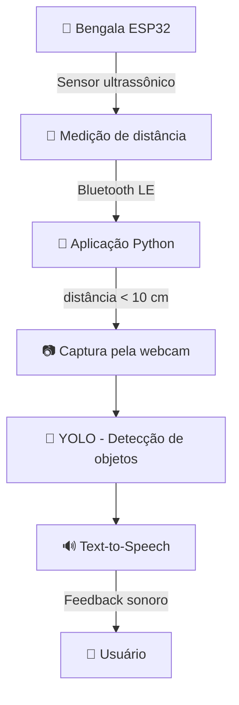

<div align="center">

# 🦯 SafeStep

### Bengala Inteligente para Auxílio à Mobilidade de Pessoas com Deficiência Visual

[](https://www.python.org/)
[](https://www.espressif.com/)
[](https://github.com/ultralytics/ultralytics)
[](https://flet.dev/)
[](https://www.bluetooth.com/)
[](https://github.com/giovannibrohrig/SafeStep)

**SafeStep** é um projeto de tecnologia assistiva que combina sensores, comunicação sem fio, visão computacional e síntese de voz para auxiliar pessoas com deficiência visual na identificação de obstáculos durante a locomoção.

[📂 Repositório](https://github.com/giovannibrohrig/SafeStep)

</div>

---

## 📑 Sumário

- [Sobre o projeto](#-sobre-o-projeto)
- [Como funciona](#-como-funciona)
- [Arquitetura do projeto](#-arquitetura-do-projeto)
- [Pré-requisitos](#-pré-requisitos)
- [Como executar](#-como-executar)
  - [ESP32](#-esp32)
  - [YOLO](#-yolo-1)
  - [Flet](#-flet-1)
- [Hardware](#-hardware)
- [Comunicação Bluetooth LE](#-comunicação-bluetooth-le)
- [Visão Computacional](#️-visão-computacional)
- [Aplicação Flet](#️-aplicação-flet)
- [Tecnologias](#️-tecnologias)
- [Estrutura do repositório](#-estrutura-do-repositório)
- [Estado atual](#-estado-atual)
- [Roadmap](#️-roadmap)
- [Equipe](#-equipe)
- [Contribuição](#-contribuição)
- [Segurança](#-segurança)
- [Licença](#-licença)

---

## 📖 Sobre o projeto

O **SafeStep** nasceu como um projeto desenvolvido no curso de **Tecnologia em Inteligência Artificial da FATEC Rio Claro**, com o objetivo de explorar como tecnologias de Inteligência Artificial e sistemas embarcados podem ser utilizadas para aumentar a autonomia e a segurança de pessoas com deficiência visual.

A solução utiliza uma **bengala equipada com sensor ultrassônico**, conectada por **Bluetooth Low Energy (BLE)** a uma aplicação responsável por interpretar os dados recebidos.

Quando um obstáculo é identificado a uma distância próxima (< 10 cm), o sistema captura uma imagem pela câmera e a encaminha para um modelo **YOLO**, que realiza a detecção dos objetos presentes na cena.

As informações identificadas são então transformadas em **feedback de áudio via text-to-speech**, permitindo que o usuário receba uma descrição dos elementos encontrados em tempo real.

### 🎯 Objetivo

Criar uma solução integrada capaz de:

* Detectar obstáculos por meio de sensores ultrassônicos;
* Medir a distância até objetos próximos;
* Transmitir informações por Bluetooth Low Energy;
* Identificar objetos utilizando visão computacional (YOLO);
* Informar ao usuário os objetos encontrados por meio de áudio;
* Integrar hardware, software e Inteligência Artificial em uma solução de tecnologia assistiva.

---

## 🧠 Como funciona

O sistema é dividido em três componentes principais que trabalham em conjunto:



### 🔄 Fluxo principal

1. O **ESP32** realiza medições contínuas utilizando o sensor ultrassônico (a cada 1s).
2. A distância é calculada a partir do tempo de retorno do sinal: `(duração × 0.0343) / 2`.
3. O ESP32 disponibiliza a distância através de uma característica **BLE** com notificações.
4. A aplicação Python utiliza **Bleak** para se conectar via MAC address e receber as notificações.
5. Quando a distância recebida fica **abaixo de 10 cm**, o sistema inicia o processo de análise visual.
6. Uma imagem é capturada pela webcam via **OpenCV**.
7. O modelo **YOLO** processa a imagem e identifica os objetos.
8. Os nomes das classes detectadas são extraídos.
9. O sistema utiliza **pyttsx3** (taxa: 140 wpm) para gerar o feedback:
   > *"Foram identificados, pessoa, cadeira, nessa imagem"*

---

## 🧩 Arquitetura do projeto

O repositório está organizado em três componentes principais:

```text
SafeStep/
│
├── ESP32/              ← Firmware MicroPython da bengala
│   ├── Sensor ultrassônico + Display OLED + Buzzer
│   ├── Comunicação Bluetooth LE (aioble)
│   └── Setup Wi-Fi para instalação de dependências
│
├── Yolo/               ← Visão computacional + Pipeline integrado
│   ├── Treinamento do modelo YOLO
│   ├── Inferência (imagens / webcam)
│   ├── Cliente BLE (bleak)
│   ├── Pipeline: BLE → Câmera → YOLO → TTS
│   └── Diagnóstico GPU
│
├── Flet/               ← Interface mobile do usuário
│   ├── Login e cadastro de usuários
│   ├── Persistência SQLite + SQLAlchemy
│   └── Interface gráfica Flet
│
├── WBS_EAP.pdf         ← Estrutura de decomposição do trabalho
├── README.md
└── .gitignore
```

---

## 📋 Pré-requisitos

### Software

| Requisito | Versão | Notas |
| --------- | ------ | ----- |
| Python | ≥ 3.11 | 3.14+ para o módulo Flet |
| [uv](https://docs.astral.sh/uv/) | Última | Gerenciador de pacotes (recomendado) |
| Git | Qualquer | Para clonar o repositório |
| CUDA Toolkit | 12.1 | Necessário apenas para treinamento/inferência GPU |

### Hardware

| Componente | Obrigatório | Notas |
| ---------- | :---------: | ----- |
| ESP32 | Sim | Microcontrolador com suporte a BLE |
| Sensor HC-SR04 | Sim | Sensor ultrassônico para medição de distância |
| Display OLED SSD1306 | Sim | 128×64 pixels, comunicação I²C |
| Buzzer | Opcional | Sinalização local de proximidade |
| Webcam | Sim | Captura de imagens para o YOLO |
| GPU NVIDIA | Recomendado | Para treinamento; inferência funciona em CPU |

---

## 🚀 Como executar

### 1. Clone o repositório

```bash
git clone https://github.com/giovannibrohrig/SafeStep.git
cd SafeStep
```

---

### ⚡ ESP32

O firmware embarcado utiliza **MicroPython** e deve ser gravado diretamente no microcontrolador.

#### Instalação de dependências no ESP32

O script `installing_mip.py` conecta o ESP32 ao Wi-Fi e instala a biblioteca `aioble` via `mip`:

```bash
# Executar no ESP32 via REPL ou IDE MicroPython
# O script conecta à rede Wi-Fi e instala o pacote aioble
```

> **Nota:** O script contém credenciais Wi-Fi hardcoded. Altere o SSID e senha antes de executar.

#### Scripts disponíveis

| Script | Descrição |
| ------ | --------- |
| `detect_distance_and_send_with_bluetooth.py` | **Principal.** Mede distância, exibe no OLED e transmite via BLE |
| `buzzer_quando_perto.py` | Modo standalone: sinaliza via display quando obstáculo < 10 cm |
| `installing_mip.py` | Setup: instala `aioble` via Wi-Fi |

---

### 🤖 YOLO

```bash
cd Yolo
```

#### Instalar dependências

```bash
# Com uv (recomendado)
uv sync

# Ou com pip
pip install -e .
```

> **Nota:** O PyTorch é configurado com suporte a **CUDA 12.1**. Para instalações sem GPU, ajuste o `pyproject.toml`.

#### Verificar GPU

```bash
python teste_gpu.py
```

#### Executar detecção em imagens

```bash
python detect_images.py
```

Processa imagens de `./imagens_testes` e salva resultados em `./resultados_teste`.

#### Executar detecção pela webcam

```bash
python detect_webcam.py
```

#### Executar o pipeline integrado (BLE + Câmera + YOLO + TTS)

```bash
python tirar_e_reconhecer_imagens.py
```

> ⚠️ Requer: webcam funcional, modelo treinado em `./Melhores_treinamentos/train_v5/best.pt`, e bengala ESP32 pareada via BLE (MAC: `14:33:5C:6B:B5:96`).

#### Treinar o modelo

```bash
python main.py
```

| Parâmetro | Valor |
| --------- | ----- |
| Epochs | 400 |
| Image size | 640 |
| Batch size | 16 |
| Optimizer | SGD |
| Learning rate | 0.0005 |
| Patience | 40 |
| Device | GPU 0 |
| Workers | 8 |
| AMP | Habilitado |
| Dataset | `./datasets/blind-assistant-2` |

---

### 📱 Flet

```bash
cd Flet
```

#### Instalar dependências

```bash
# Com uv (recomendado)
uv sync

# Ou com pip
pip install -r requirements.txt
```

#### Executar a aplicação

```bash
python app.py
```

A aplicação abre uma janela desktop (900×600) com tela de login, cadastro de usuários e dashboard principal.

---

## 🔌 Hardware

### Pinagem do ESP32

| GPIO | Componente | Função |
| ---: | ---------- | ------ |
| `18` | HC-SR04 | Trigger do sensor ultrassônico |
| `19` | HC-SR04 | Echo do sensor ultrassônico |
| `21` | SSD1306 | I²C SCL (clock) |
| `22` | SSD1306 | I²C SDA (dados) |
| `5`  | Buzzer | Sinalização sonora |

### Configuração I²C

```text
Frequência: 400 kHz
Display:    128 × 64 pixels (SSD1306)
```

> A montagem física deve seguir o circuito efetivamente utilizado pela equipe. Os pinos acima representam as configurações encontradas no código atual.

---

## 📡 Comunicação Bluetooth LE

A comunicação entre a bengala e a aplicação utiliza **Bluetooth Low Energy**.

### Configuração BLE

| Parâmetro | Valor |
| --------- | ----- |
| Nome do dispositivo | `BengalaInteligente` |
| Service UUID | `a07498ca-ad5b-474e-940d-16f1fbe7e8cd` |
| Characteristic UUID | `51ff12bb-3ed8-46e5-b4f9-d64e2147f29b` |
| Modo | Read + Notify |
| Intervalo de advertising | 250 ms |
| MAC address (hardcoded) | `14:33:5C:6B:B5:96` |

### Fluxo de comunicação

```text
ESP32 (Peripheral)                      Python (Central)
──────────────────                      ────────────────
Advertising "BengalaInteligente"  ────→  Scan + Connect (Bleak)
                                  ←────  Subscribe to notifications
Mede distância (a cada 1s)
Escreve na characteristic         ────→  Callback recebe distância
                                         Se < 10 cm → aciona pipeline
```

> **Nota:** O MAC address `14:33:5C:6B:B5:96` está hardcoded em `detect_BLE.py`. Para utilizar com outro ESP32, altere esse valor.

---

## 👁️ Visão Computacional

O módulo de visão computacional utiliza a biblioteca **Ultralytics YOLO**.

### Modelos disponíveis

| Arquivo | Descrição |
| ------- | --------- |
| `Melhores_treinamentos/train_v5/best.pt` | Modelo treinado (principal) |
| `weights/yolo26n.pt` | Peso base YOLOv26 nano |

### Scripts de inferência

| Script | Entrada | Saída |
| ------ | ------- | ----- |
| `detect_images.py` | `./imagens_testes/` | `./resultados_teste/` |
| `detect_webcam.py` | Webcam (índice 0) | Janela em tempo real |
| `detect_BLE.py` | Notificações BLE | Distâncias via async generator |
| `tirar_e_reconhecer_imagens.py` | BLE + Webcam | `./fotos_analisadas/` + áudio TTS |

### Pipeline integrado (`tirar_e_reconhecer_imagens.py`)

1. Escuta notificações BLE da bengala
2. Quando distância < 10 cm:
   - Captura imagem pela webcam → salva em `fotos_analise_pendente/`
   - Executa inferência YOLO
   - Extrai classes detectadas (nomes únicos)
   - Salva imagem anotada em `fotos_analisadas/`
   - Remove captura temporária
   - Gera feedback por voz: *"Foram identificados, [objetos], nessa imagem"*

---

## 🖥️ Aplicação Flet

O diretório `Flet/` contém uma aplicação desktop desenvolvida em **Python + Flet**.

### Funcionalidades

* 🔐 Tela de login com validação de credenciais
* 📝 Cadastro de novos usuários
* 🏠 Dashboard principal com imagem de fundo
* 🚪 Logout e retorno à tela de login
* 💾 Persistência via SQLite + SQLAlchemy

### Banco de dados

| Tabela | Campo | Tipo |
| ------ | ----- | ---- |
| `Usuario` | `id` | Integer / Primary Key |
| `Usuario` | `usuario` | String(50) / Unique |
| `Usuario` | `senha` | String(100) |

```text
Banco: sqlite:///projeto.db
```

> ⚠️ **Nota de segurança:** O sistema de autenticação atual é um protótipo. As credenciais são armazenadas sem hashing de senha. Essa implementação deve ser reforçada antes de qualquer utilização em produção.

---

## 🛠️ Tecnologias

### Software

| Tecnologia | Utilização |
| ---------- | ---------- |
| 🐍 Python | Linguagem principal |
| 🎯 Ultralytics YOLO | Detecção de objetos |
| 🔥 PyTorch (CUDA 12.1) | Infraestrutura de Machine Learning |
| 📷 OpenCV | Captura e processamento de imagens |
| 🗣️ pyttsx3 | Síntese de voz (text-to-speech) |
| 📡 Bleak | Cliente BLE (lado Python) |
| 🖥️ Flet | Interface gráfica desktop |
| 🗃️ SQLAlchemy | ORM para banco de dados |
| 💾 SQLite | Persistência local |
| ⚡ asyncio | Programação assíncrona |

### Hardware / Embedded

| Tecnologia | Utilização |
| ---------- | ---------- |
| ESP32 | Microcontrolador com BLE |
| MicroPython | Runtime embarcado |
| aioble | Biblioteca BLE assíncrona |
| SSD1306 | Driver do display OLED |
| HC-SR04 | Sensor ultrassônico |
| I²C | Protocolo de comunicação com display |

---

## 📂 Estrutura do repositório

```text
SafeStep/
│
├── ESP32/
│   ├── src/esp32/                                 # Módulo Python (entry point)
│   ├── lib/aioble/                                # Biblioteca BLE (MicroPython)
│   ├── detect_distance_and_send_with_bluetooth.py # Script principal do firmware
│   ├── buzzer_quando_perto.py                     # Sinalização local de proximidade
│   ├── installing_mip.py                          # Setup Wi-Fi + instalação aioble
│   ├── pyproject.toml                             # Config do projeto (uv)
│   └── uv.lock
│
├── Flet/
│   ├── src/safestep_app_flet/                     # Módulo Python (entry point)
│   ├── app.py                                     # Aplicação principal (login + dashboard)
│   ├── main.py                                    # Protótipo de login (hardcoded)
│   ├── models.py                                  # ORM SQLAlchemy (tabela Usuario)
│   ├── projeto.db                                 # Banco SQLite
│   ├── pyproject.toml                             # Config do projeto (uv)
│   ├── requirements.txt                           # Dependências (pip)
│   └── uv.lock
│
├── Yolo/
│   ├── Melhores_treinamentos/
│   │   └── train_v5/best.pt                       # Modelo treinado (principal)
│   ├── weights/yolo26n.pt                         # Peso base YOLO
│   ├── datasets/blind-assistant-2/                # Dataset de treinamento
│   ├── fotos_analisadas/                          # Resultados do pipeline
│   ├── fotos_analise_pendente/                    # Capturas temporárias
│   ├── imagens_testes/                            # Imagens para teste manual
│   ├── resultados_teste/                          # Resultados de teste manual
│   ├── main.py                                    # Script de treinamento
│   ├── detect_images.py                           # Inferência em lote (imagens)
│   ├── detect_webcam.py                           # Inferência em tempo real (webcam)
│   ├── detect_BLE.py                              # Cliente BLE (async generator)
│   ├── tirar_e_reconhecer_imagens.py              # Pipeline integrado completo
│   ├── teste_gpu.py                               # Diagnóstico GPU/CUDA
│   ├── pyproject.toml                             # Config do projeto (uv + CUDA)
│   └── uv.lock
│
├── runs/detect/SafeStep/                          # Artefatos de treinamento
├── WBS_EAP.pdf                                    # Documentação de planejamento
├── .gitignore
└── README.md
```

---

## 🧪 Estado atual

O SafeStep encontra-se em **desenvolvimento ativo**.

### ✅ Implementado

- [x] Medição de distância com sensor ultrassônico (HC-SR04)
- [x] Firmware ESP32 com MicroPython
- [x] Display OLED (SSD1306) para feedback visual
- [x] Buzzer para sinalização local
- [x] Comunicação Bluetooth Low Energy (aioble ↔ Bleak)
- [x] Recepção assíncrona dos dados BLE em Python
- [x] Captura de imagens pela webcam (OpenCV)
- [x] Modelo YOLO treinado (blind-assistant dataset)
- [x] Detecção de objetos em imagens estáticas
- [x] Detecção de objetos em tempo real (webcam)
- [x] Pipeline integrado: BLE → Câmera → YOLO → TTS
- [x] Text-to-Speech com pyttsx3
- [x] Aplicação Flet com login e cadastro
- [x] Persistência local com SQLite + SQLAlchemy

### 🔄 Em evolução

- [ ] Integração completa entre todos os módulos (Flet + YOLO + BLE)
- [ ] Descoberta dinâmica do dispositivo BLE (substituir MAC hardcoded)
- [ ] Refinamento da experiência do usuário
- [ ] Aprimoramento do modelo de visão computacional
- [ ] Melhorias de precisão e desempenho
- [ ] Comunicação mais robusta entre hardware e software
- [ ] Segurança da autenticação (hashing de senhas)
- [ ] Testes automatizados
- [ ] Documentação de montagem do hardware
- [ ] Compatibilidade cross-platform (`os.startfile` → solução genérica)

---

## 🗺️ Roadmap

```text
[x] Protótipo do sensor ultrassônico
[x] Comunicação BLE (ESP32 ↔ Python)
[x] Aplicação desktop (Flet)
[x] Treinamento YOLO (train_v5)
[x] Detecção de objetos (imagens + webcam)
[x] Captura automática de imagens
[x] Feedback por voz (pyttsx3)
[ ] Integração final: Flet + YOLO + BLE
[ ] Descoberta automática de dispositivos BLE
[ ] Testes sistemáticos
[ ] Otimização e fine-tuning do modelo
[ ] Documentação completa do hardware
[ ] Validação em cenários reais
```

---

## ⚠️ Observações importantes

O SafeStep é um **protótipo acadêmico em desenvolvimento**.

A utilização de uma solução experimental como único mecanismo de auxílio à mobilidade pode apresentar riscos. O sistema não deve ser considerado, em seu estado atual, um substituto para dispositivos ou métodos de orientação e mobilidade profissionalmente validados.

### Limitações conhecidas

| Limitação | Detalhe |
| --------- | ------- |
| Senhas sem hashing | Credenciais armazenadas em texto plano no SQLite |
| MAC address hardcoded | `14:33:5C:6B:B5:96` em `detect_BLE.py` |
| Wi-Fi hardcoded | SSID/senha fixos em `installing_mip.py` |
| Windows-only | `os.startfile()` em `detect_images.py` |
| Hardware específico | Depende de ESP32 + HC-SR04 + SSD1306 |
| Câmera obrigatória | Pipeline requer webcam conectada |
| Modelo local | Pesos `.pt` devem estar disponíveis localmente |
| UUIDs fixos | Serviço e característica BLE com UUIDs específicos |

---

## 👥 Equipe

Projeto desenvolvido no contexto do curso de **Tecnologia em Inteligência Artificial da FATEC Rio Claro**.

| Integrante | Área |
| ---------- | ---- |
| **Davi Tonin** | YOLO |
| **Giovanni Rohrig** | YOLO |
| **Gustavo Cruz** | Lógica |
| **João Paulo** | Pareamento |
| **João Pedro** | Pareamento |
| **João Vitor** | Lógica |
| **Juliano Murbach** | Design |
| **Lucas Batalha** | Design |

---

## 📄 Documentação

O repositório contém documentação de planejamento:

| Arquivo | Descrição |
| ------- | --------- |
| `WBS_EAP.pdf` | Estrutura de Decomposição do Trabalho (EAP/WBS) |

---

## 🤝 Contribuição

Sugestões, correções e melhorias são bem-vindas.

```bash
# Clone o repositório
git clone https://github.com/giovannibrohrig/SafeStep.git
cd SafeStep

# Crie uma branch para sua alteração
git checkout -b feature/minha-feature

# Faça suas alterações e registre o commit
git add .
git commit -m "feat: adiciona minha feature"

# Envie sua branch
git push origin feature/minha-feature
```

Depois, abra um **Pull Request** no GitHub.

---

## 🔐 Segurança

Caso o projeto evolua para utilização fora do ambiente de prototipagem, recomenda-se revisar especialmente:

* 🔑 Armazenamento de senhas (implementar hashing com bcrypt/argon2)
* 🌐 Credenciais Wi-Fi no script de setup
* 📡 Segurança da comunicação BLE
* ✅ Validação dos dados recebidos via BLE
* 🗄️ Proteção do banco local
* 🔒 Controle de acesso à aplicação
* 📷 Privacidade das imagens capturadas
* 🏠 Remoção de MAC address hardcoded

---

## 📜 Licença

**Ainda não definida.**

Até que uma licença seja adicionada ao projeto, os termos de utilização, modificação e redistribuição devem ser considerados conforme os direitos aplicáveis ao código original.

---

<div align="center">

### 🦯 SafeStep

**Tecnologia + Inteligência Artificial + Acessibilidade**

Desenvolvido como projeto acadêmico na
**FATEC Rio Claro**

<br>

[](https://github.com/giovannibrohrig/SafeStep)

</div>
